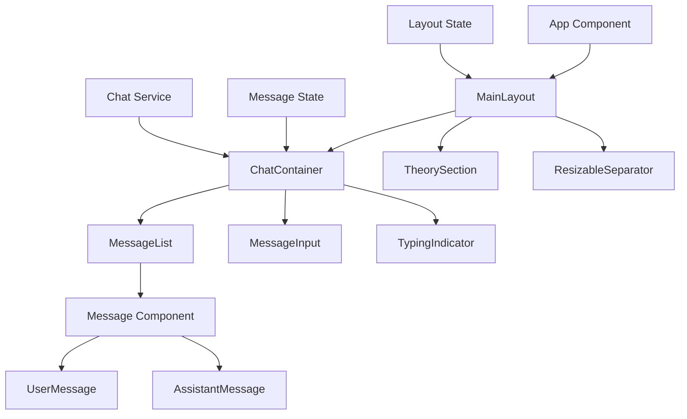

# Design Document

## Overview

The ReactJS chatbot application will be built as a single-page application using modern React patterns including functional components, hooks, and CSS modules for styling. The application will feature a dual-pane layout with a chat interface on the left and a theorem prover facts section on the right, connected by a resizable separator. The chat interface includes real-time message display, automatic scrolling, and responsive design that works across desktop and mobile devices.

## Architecture

The application follows a component-based architecture with a dual-pane layout and clear separation of concerns:



### Core Components

- **App**: Root component that provides global state and routing
- **MainLayout**: Container component managing the dual-pane layout with resizable functionality
- **ChatContainer**: Main chat interface container managing message state (left pane)
- **TheorySection**: Theorem prover facts display component (right pane)
- **ResizableSeparator**: Interactive separator allowing users to resize panes
- **MessageList**: Scrollable container for displaying conversation history
- **Message**: Base message component with common functionality
- **UserMessage**: Specialized component for user messages (right-aligned)
- **AssistantMessage**: Specialized component for assistant messages (left-aligned)
- **MessageInput**: Input field with send functionality
- **TypingIndicator**: Loading state component for assistant responses

## Components and Interfaces

### Message Data Model

```typescript
interface Message {
  id: string;
  content: string;
  sender: 'user' | 'assistant';
  timestamp: Date;
  status?: 'sending' | 'sent' | 'error';
}

interface ChatState {
  messages: Message[];
  isTyping: boolean;
  error?: string;
}
```

### Component Props

```typescript
// MainLayout Component
interface MainLayoutProps {
  children: React.ReactNode;
  initialChatWidth?: number;
  minChatWidth?: number;
  minTheoryWidth?: number;
}

// TheorySection Component
interface TheorySectionProps {
  content?: string;
  className?: string;
}

// ResizableSeparator Component
interface ResizableSeparatorProps {
  onResize: (newChatWidth: number) => void;
  minChatWidth: number;
  minTheoryWidth: number;
}

// MessageList Component
interface MessageListProps {
  messages: Message[];
  isTyping: boolean;
}

// Message Component
interface MessageProps {
  message: Message;
}

// MessageInput Component
interface MessageInputProps {
  onSendMessage: (content: string) => void;
  disabled?: boolean;
}
```

### Chat Service Interface

```typescript
interface ChatService {
  sendMessage(content: string): Promise<string>;
  onError?: (error: Error) => void;
}
```

## Data Models

### Message Flow

1. **User Input**: User types message and submits via Enter key or send button
2. **Message Creation**: New message object created with unique ID and timestamp
3. **State Update**: Message added to chat state, input cleared
4. **Assistant Response**: Chat service processes message and generates response
5. **Response Display**: Assistant message added to chat state
6. **Auto-scroll**: Interface scrolls to show latest message

### State Management

The application uses React's built-in state management with hooks:

- `useState` for message list, typing state, input value, and layout dimensions
- `useEffect` for auto-scrolling, cleanup, and resize event handling
- `useRef` for scroll container reference and resize drag operations
- `useCallback` for optimized event handlers and resize functions
- Layout state management for maintaining pane proportions and minimum widths

## Error Handling

### Input Validation
- Empty message prevention
- Maximum message length limits
- Special character handling

### Network Errors
- Connection timeout handling
- Retry mechanism for failed requests
- User-friendly error messages
- Graceful degradation when service unavailable

### UI Error States
- Failed message indicators
- Retry buttons for failed messages
- Error message display in chat interface
- Loading state management

## Testing Strategy

### Unit Testing
- Component rendering tests
- Message formatting and display
- Input validation and submission
- State management logic
- Auto-scroll functionality

### Integration Testing
- Message flow from input to display
- Chat service integration
- Error handling scenarios
- Responsive behavior testing

### User Experience Testing
- Keyboard navigation (Enter to send, Tab navigation)
- Touch interaction on mobile devices
- Scroll behavior and performance
- Accessibility compliance (ARIA labels, screen reader support)

## Layout Design

### Dual-Pane Architecture
The application implements a resizable dual-pane layout to satisfy Requirement 7:

**Design Rationale**: The dual-pane layout allows users to simultaneously view chat conversations and theorem prover facts, enhancing the logical context understanding. The resizable separator provides flexibility for users to adjust the layout based on their current focus.

**Layout Structure**:
- **Left Pane**: Chat interface (ChatContainer) with minimum width of 300px
- **Right Pane**: Theory section displaying theorem prover facts with minimum width of 250px
- **Separator**: 4px interactive divider allowing horizontal resizing via mouse drag

**Responsive Behavior**:
- **Desktop (1024px+)**: Full dual-pane with resizable separator
- **Tablet (768px-1024px)**: Dual-pane with fixed proportions (70% chat, 30% theory)
- **Mobile (<768px)**: Single-pane chat interface with collapsible theory section

### Resizable Functionality
**Implementation Strategy**:
- Mouse event handling for drag operations on the separator
- Real-time width calculations with minimum width constraints
- Smooth visual feedback during resize operations
- Persistence of user-preferred layout proportions in localStorage

## Styling and Responsive Design

### CSS Architecture
- CSS Modules for component-scoped styling
- CSS Custom Properties for theming and layout dimensions
- Flexbox for dual-pane layout management
- CSS Grid for complex layouts where needed

### Responsive Breakpoints
- Mobile: 320px - 768px (single-pane layout, theory section hidden or collapsed)
- Tablet: 768px - 1024px (dual-pane with reduced theory section width)
- Desktop: 1024px+ (full dual-pane layout with resizable separator)

### Design Tokens
```css
:root {
  --primary-color: #007bff;
  --user-message-bg: #007bff;
  --assistant-message-bg: #f1f3f4;
  --theory-section-bg: #fafafa;
  --separator-color: #ddd;
  --separator-hover-color: #007bff;
  --text-color: #333;
  --border-radius: 18px;
  --spacing-sm: 8px;
  --spacing-md: 16px;
  --spacing-lg: 24px;
  --min-pane-width: 300px;
  --separator-width: 4px;
}
```

### Component Styling
- **User Messages**: Right-aligned, blue background, white text
- **Assistant Messages**: Left-aligned, light gray background, dark text
- **Timestamps**: Subtle, positioned below messages
- **Typing Indicator**: Animated dots, left-aligned
- **Theory Section**: Light gray background, scrollable content area, proper typography hierarchy
- **Resizable Separator**: Subtle gray line with blue hover state and cursor feedback

## Performance Considerations

### Optimization Strategies
- Virtual scrolling for large message histories (if needed)
- Message memoization to prevent unnecessary re-renders
- Debounced input handling
- Lazy loading of message content
- Image optimization for any media messages

### Auto-scroll Implementation
- Scroll to bottom on new messages
- Preserve scroll position when user scrolls up
- Smooth scrolling animations
- Performance-optimized scroll detection
- Independent scrolling for chat and theory sections

## Accessibility

### WCAG Compliance
- Proper ARIA labels for interactive elements
- Keyboard navigation support
- Screen reader compatibility
- High contrast mode support
- Focus management for dynamic content

### Semantic HTML
- Proper heading hierarchy
- List semantics for message history
- Form labels and descriptions
- Landmark regions for navigation