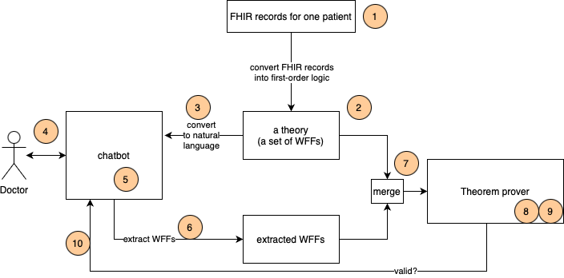

# Background and technical discussion

## Motivation
Generative AI applications have already shown promise in healthcare: they both save time and democratize access to specialized biomedical resources. In healthcare, accuracy is critical. For example, if a clinical application says that “Patient X’s most recent blood pressure was 120/80” and this statement is false, then providers and patients will rightly not trust this application and, equally rightly, will not use it.

Unfortunately, state-of-the-art large language models (LLMs), while showing a masterful display of the syntax of natural languages, still insist on confabulating and reasoning incorrectly. Despite the industry’s reliance on the now-discredited [scaling laws](https://arxiv.org/pdf/2001.08361), and despite the fact that today’s models are clearly more powerful and capable than models of even 6 months ago, the latest models still consistently confabulate (and, on some metrics, they confabulate [_worse_](https://www.nytimes.com/2025/05/05/technology/ai-hallucinations-chatgpt-google.html) than older models).

In healthcare, for users to trust Generative AI applications, they must trust that these applications provide accurate information. The industry’s current reliance on [scaling laws](https://arxiv.org/pdf/2001.08361) (i.e., using the same technology but using more parameters, training for longer, and on more data) has not yet provided us a reliable path towards trustworthy systems with fewer confabulations and reasoning errors.

We here demonstrate a solution that successfully mitigates confabulations. We focus on one particular use case: a clinical chatbot that a clinician (e.g., a doctor) can use to answer questions about one patient’s medical record.

For example, consider a possible conversation:

```
Doctor: What is the patient’s name?
AI: The patient’s name is Joe Bloggs
Doctor: What was his most recent heart rate measurement?
AI: On 21 July, the patient’s heart rate was 65.
Doctor: Was his heart rate ever above 90?
AI: No, none his heart rate readings were above 90.
```

For each of these three responses from the chatbot (“AI: …”), the demo in this repo will logically verify that these statements are valid (or not) with respect to the patient's medical record.

## Formal logic
Formal logic is a systematic method of reasoning that uses symbolic (formal) languages to represent and analyze arguments, propositions, and inferences. It focuses on the structure (form) of logical arguments rather than their semantics, allowing for rigorous evaluation of validity and soundness. Formal logic employs precise symbols and rules to represent logical relationships, such as implication (⇒), the universal quantifier (∀), the existential quantifier (∃), conjunction (∧), disjunction (∨), and negation (¬).

Consider the following well-known example:

```
(∀ (X) (⇒ (human X) (mortal X)))
(human Socrates)
```

These two well-formed formulas (WFFs) together are called a _theory_. Given this theory, a theorem prover can deduce that `(mortal Socrates)` is correct (or, valid) and that `(not (mortal Socrates))` is false (or, invalid).

## Neuro-symbolic AI
[Neuro-symbolic AI](https://en.wikipedia.org/wiki/Neuro-symbolic_AI) combines the strengths of neural networks (their understanding of the syntax of natural language) and the strengths of symbolic reasoners (their understanding of the world and ability to reason about it). This hybrid approach addresses key limitations of both pure neural and pure symbolic systems: neural networks lack interpretability and struggle with reasoning, while symbolic systems can be brittle and don’t understand natural language.

By integrating these approaches, neuro-symbolic AI can achieve more robust reasoning, better generalization, and more transparent decision-making. For example, a neuro-symbolic system might use neural networks to process raw sensory input but then apply symbolic logic to reason about the relationships between recognized objects, like how humans combine pattern recognition with abstract thought.

## Cvc5
We use an open-source [first-order](https://en.wikipedia.org/wiki/First-order_logic) theorem prover, [cvc5](https://cvc5.github.io).

One of the most important decisions to make when choosing a theorem prover is the expressiveness of the required theory. This determines the efficiency of inference (e.g., is it decidable?) and the ability to express the concepts that we need.

The two most-used types of theories are [propositional](https://en.wikipedia.org/wiki/Propositional_logic) and [first-order](https://en.wikipedia.org/wiki/First-order_logic) (or predicate). A propositional theory is a set of statements like `(and a (=> b c))` where `a`, `b`, and `c` are atomic. First-order theories build on propositional theories by also allowing quantifiers, predicates and functions. This demo uses first order theories because in healthcare we need to express concepts like `(> (heart-rate patient_0 time_0) 42)`. We will also need to express concepts like 

### At at least one time, patient_1’s heart rate was over 50.

```
(exists t (> (heart-rate patient_1 t) > 50)
```

### patient_1’s most recent heart rate reading of value_0 was at time t_0.
```
(exists value_0
    (and (= (heart-rate patient_1 t_0) value_0)
         (forall t
            (=> (exists value_1
                    (= (heart-rate patient_1 t)    
                        value_1)))
                (<= t t_0))))
```

A solver that supports only propositional theories (no quantifiers, relations, or functions) would not alow us to, for example, reason over time (`(forall t …)`) or use predicates such as `(heart-rate …)`.

## Demo overview
This repo contains a demo of a chatbot based on exactly one patient’s healthcare records (e.g., [FHIR](https://www.hl7.org/fhir/overview.html) records). This chatbot can answer questions whose answers are derived from those healthcare records. 

Some key attributes of this demo include:
1.	An underlying chatbot that has one patient’s healthcare records included in its context.
2.	A formal representation of these healthcare records.
3.	The ability to extract a set of logical WFFs (e.g., `(= (heart-rate p0 t0) 55)`) from a natural language statement (e.g. “heart rate is 55”).
4.	A theorem prover that can determine whether each of the extracted WFFs (#3) are valid in the context of the theory (#2) and the other extracted WFFs.

## Functional architecture

This is the functional architecture for the demo in this repo; it is a chatbot that logically verifies its responses.

 

The steps indicated in the diagram are:
1.	First, one patient’s FHIR records (or a simplification thereof) are transformed into a logical theory, a set of WFFs that represent those records. These WFFs are carefully designed to be non-contradictory. As part of this translation, WFFs are added to satisfy the [Closed World Assumption](https://en.wikipedia.org/wiki/Closed-world_assumption). This translation process is entirely programmatic and fast.
2.	The theory is a set of WFFs that are not modified during a session.
3.	After the theory is created, it is converted into natural language (by a straightforward, simple process) that will be used by the chatbot Agent for in-context learning.
4.	Now that the chatbot has a theory, it can start, and a doctor can converse with it.
5.	The chatbot is implemented as a [Strands Agents](https://strandsagents.com/latest/) Agent.
6.	The main difference between this chatbot and a simple chatbot is that the underlying Agent’s response is not given directly back to the doctor. Instead, an Agent extracts one or more first-order WFFs from the response.
7.	These WFFs (which are a logical representation of claims made in the response) are merged with the WFFs from the theory. This merger is simply a concatenation of the two sets.
8.	A theorem prover takes this merged set of WFFs and determines if all the included WFFs are mutually consistent. There are three possible results:
    1. _Valid_ means that there are no contradictions, which means that the extracted WFFs don’t contradict anything in the theory.
    2. _Invalid_ means that contradictions were found. For example, if the theory contains the statement `(= heart-rate 50)` and the extracted WFFs include the statement `(= heart-rate 60)` then this is a contradiction, so the extracted WFF is false.
    3. _Unknown_ means that the theorem prover can’t decide either way. There are three main causes:
        1.	The theorem prover ran out of time (memory, space) and quit.
        1.	The deductions are too complex. This typically happens with quantifiers: theories with quantifiers are undecidable (e.g., how do we prove (forall x (P x))?) and require sophisticated heuristics to guide the deductive inference.
        1.	The statement being checked is outside of the domain of discourse of the theory. For example, the WFF `(= (religion Pope) Catholic)` is neither valid nor invalid with respect to the above theory (step 1).
9.	Last, the information from the theorem prover (valid/invalid/unknown) is presented to the user along with the response. The current demo just displays the validity of the response to the user. We can easily imagine more elaborate scenarios like fixing the response to make it valid.


## Future directions

To scale out to realistic use cases, we should understand and mitigate the following technical risks:
* The theorem prover’s speed is dependent on the size and complexity of the theory. The theory is based on the patient’s FHIR records so we should understand how performance degrades as the number of records increases.
* The system depends on the ability to use an Agent to extract WFFs from the chatbot’s response. In our demo we find this extraction process works well but it will need work to generalize and harden it.
* To de-scope the demo we process a small subset of FHIR records that address the key technical risks. Expanding the scope to cover a greater percentage of types of FHIR records will require some messy programming and maybe the development of some microtheories to guide the deduction.
* First-order theorem provers are undecidable: there are WFFs that the theorem prover is either theoretically or practically unable to validate. This main issue here is quantifiers, for example _in the general case_ `(forall X P(X))` is undecidable because the domain of `X` could be infinite, or even just very large. First-order provers circumvent this by with user-provided hints that guide the theorem prover’s search.
* This technique increases the chatbot’s latency. We should better understand this and compare the accuracy-latency trade-off against alternative ways of improving accuracy.

## Results

By running the source code, viewing the screenshots, or the video demo, we believe that it is clear that the demo in this repo represents a promising first step towards more-accurate clinical chatbots

