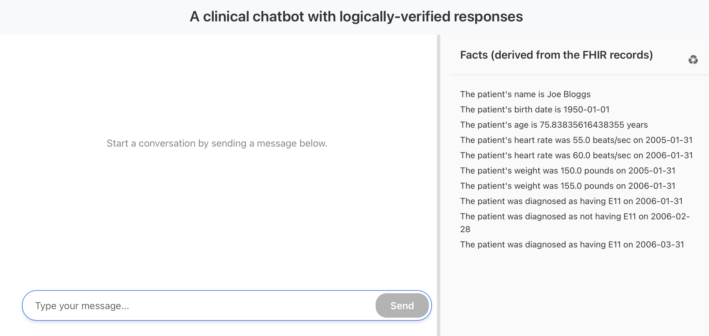
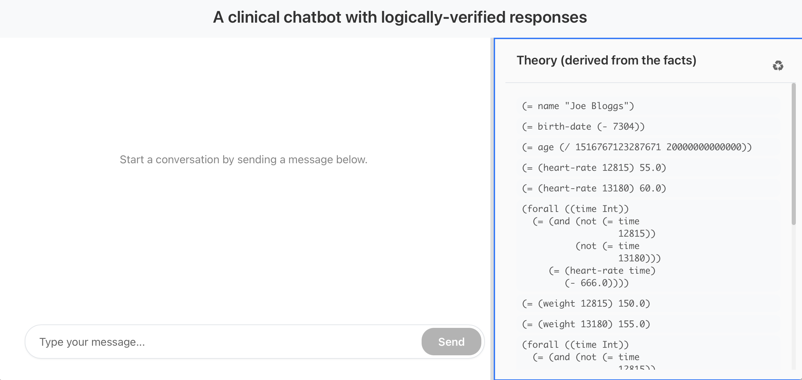
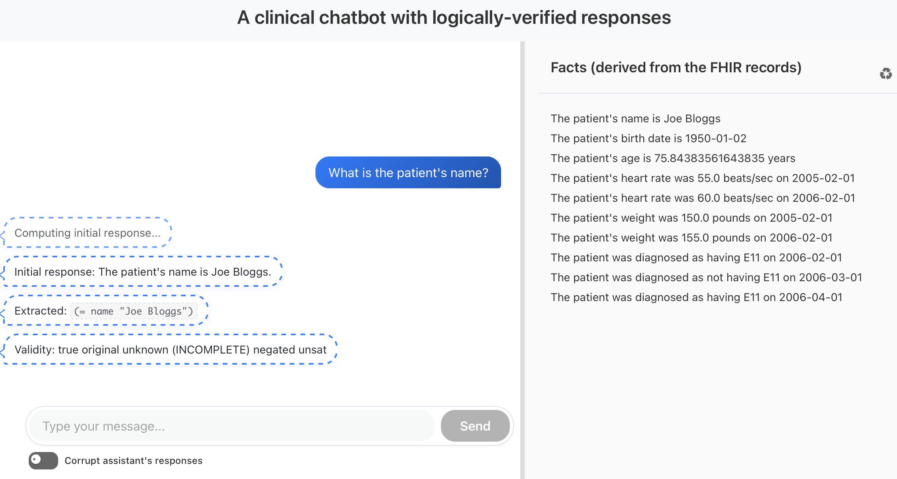
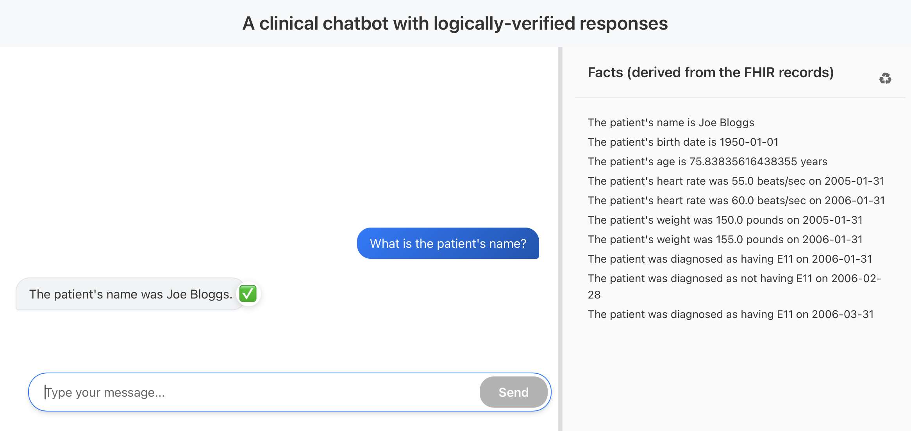
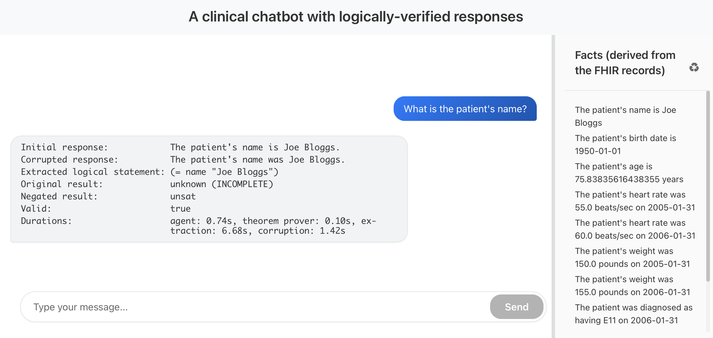
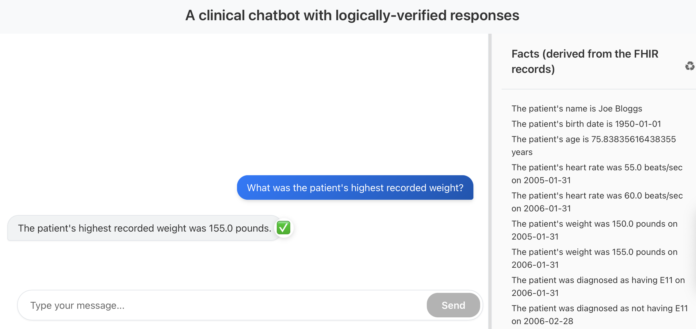
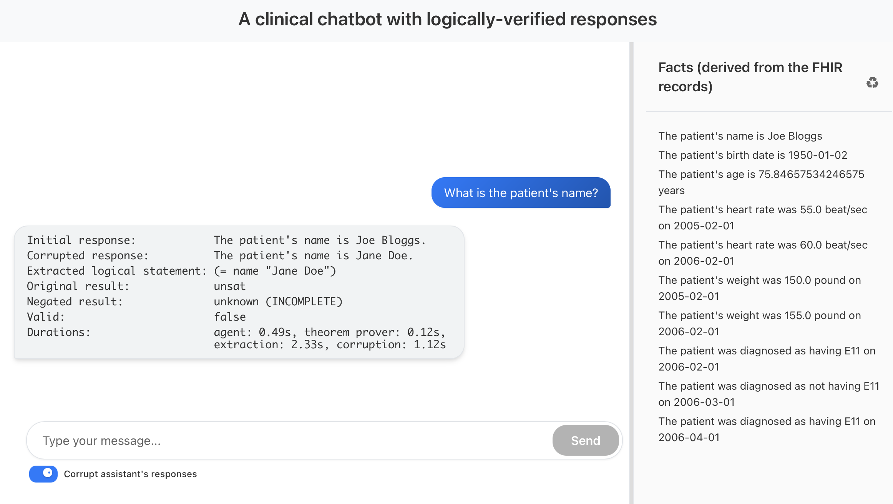
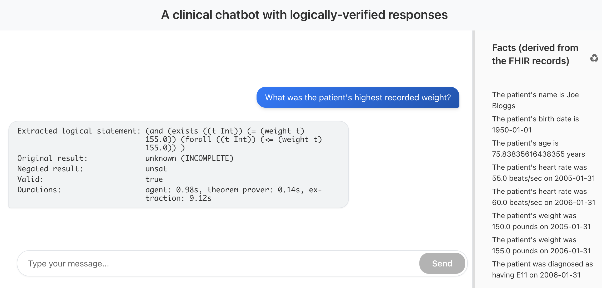
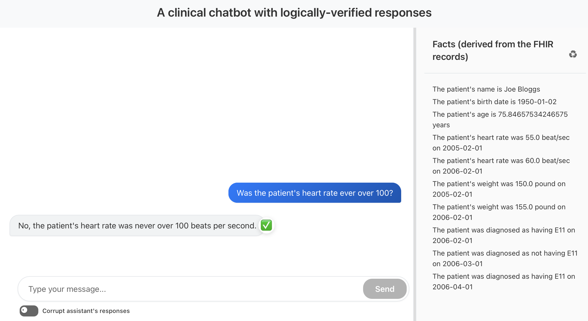
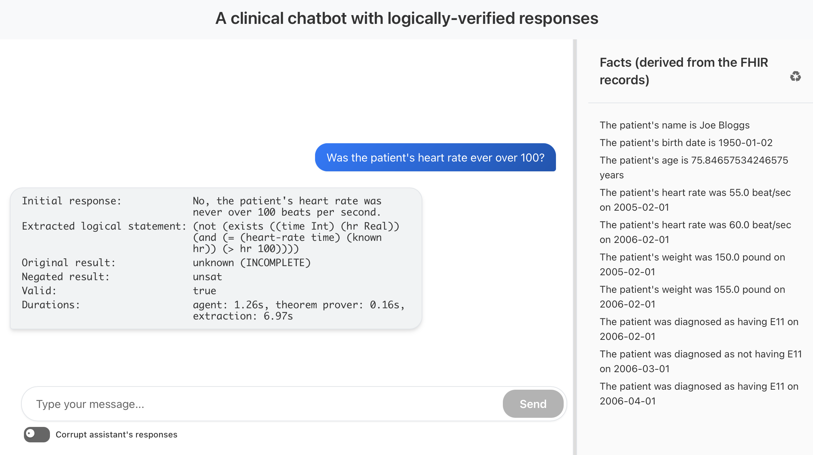

# Screenshots

When the chatbot starts, on the righthand pane contains a natural language representation of the theory that the chatbot agent will use to derive subsequent assistant's responses:

By clicking on the recycling-like button on the top right we can see an alternative view: the WFFs that constitute the theory in the right-hand pane. Note that this includes axioms to support the Closed World Assumption:

We start by asking the chatbot a very simple question, we first see indications of what the agent is doing:

and, finally, we see the result:

By clicking on the assistant's response speech bubble, we see an alternative view of the response:

When the set of medical records is trivial, the chatbot Agent will usually be correct. To facilitate testing on these trivial data sets, we added a module that _corrupts_ the chatbot Agent’s response to mimic a poorly performing model (poorly performing either because the model is weak, or because the theory is complicated, or both). We try again:

Notice that it is flagging this response as being logically not compatible with the facts. We can also see the usual behind-the-scenes details:

We can also ask more complicated questions:

And, like before, we can click on the assistant response to see the
alternative view. Note here that the natural language statement has
been converted into a logical statement that is non-trivial:

And here is another example:

With the details:

