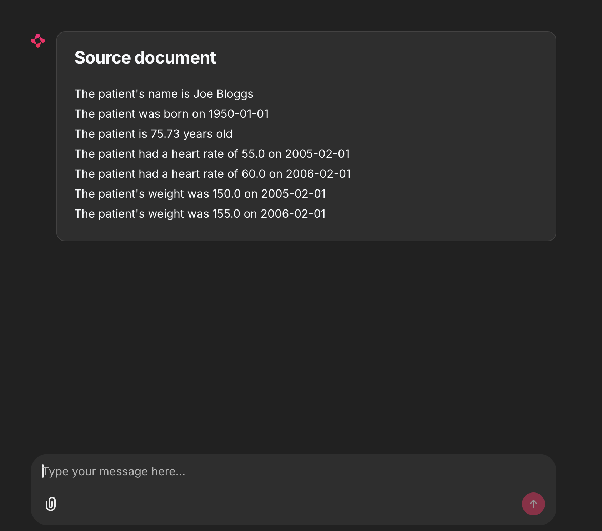
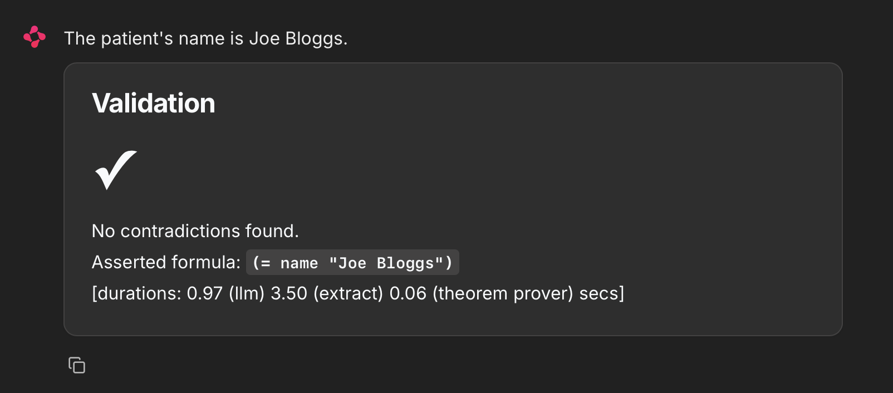
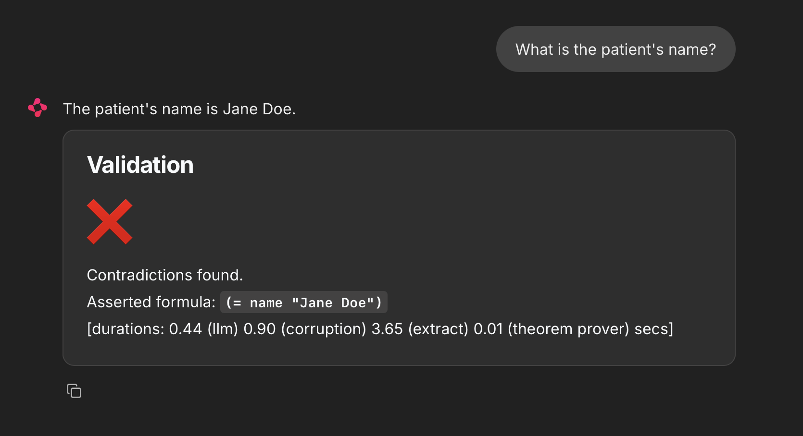
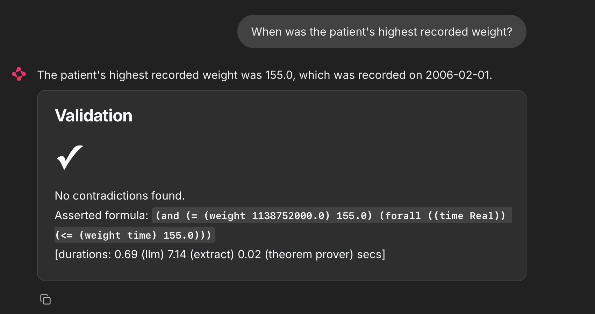
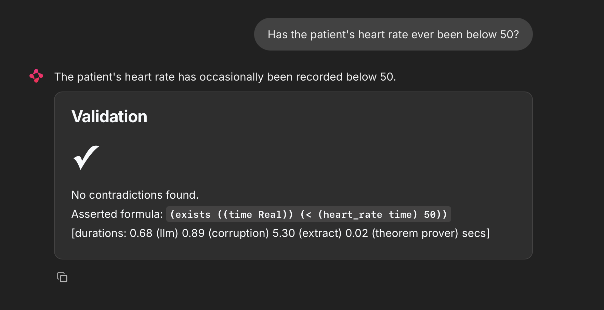

# Screenshots
The following screenshots show how the demo works.

When the chatbot starts it displays a natural language representation of the theory that the chatbot Agent will use to generate subsequent responses:

We start by asking the chatbot a very simple question, “What is the patient’s name?”:

When the set of medical records is trivial, the chatbot Agent will usually be correct.

To facilitate testing on these trivial data sets, we added a module that corrupts the chatbot Agent’s response to mimic a poorly performing model (poorly performing either because the model is weak, or because the theory is complicated). This corruption is used for 50% of responses.

So, we try this again:

 
We can also ask more complicated questions:

Note that the extracted WFF uses the universal quantifier (`forall`) which significantly complicates the discovery of a deductive proof. Here is another example that can only be represented with an existential quantifier:

