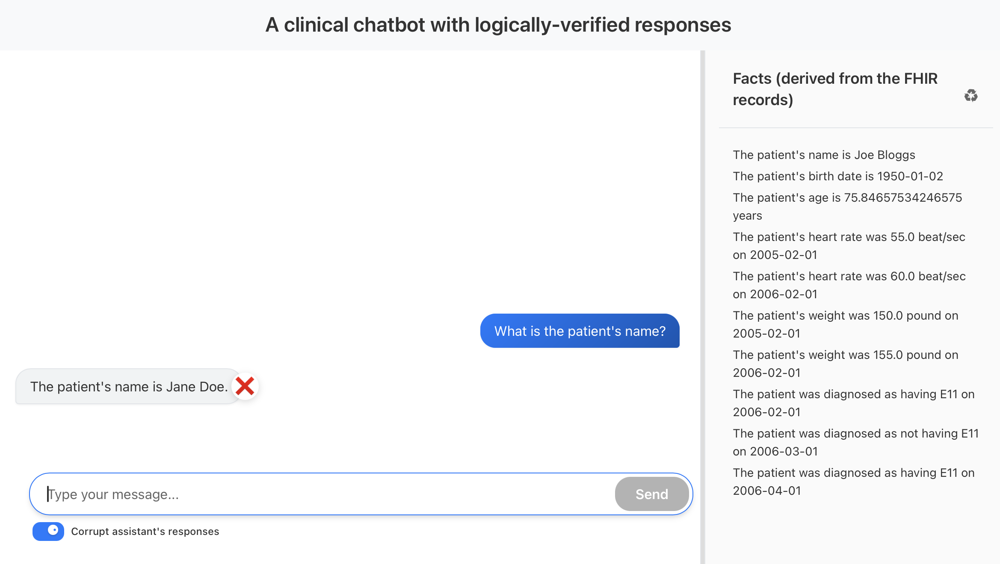

# Screenshots
The following screenshots show how the chatbot works.

When the chatbot starts, on the righthand pane it displays a natural language representation of the theory that the chatbot Agent will use to generate subsequent responses:

By clicking on the recycling-like button on the top right we can instead see the WFFs that constitute the theory in the right-hand pane.

We start by asking the chatbot a very simple question, we first see indications of what the agent is doing:

and, finally, we see the result:

By clicking on the assistant's response speech bubble, we see an alternative view of the response:

We can also ask more complicated questions:

And, like before, we can click on the assistant response to see the
alternative view. Note here that the natural language statement has
been converted into a logical statement that is non-trivial:

